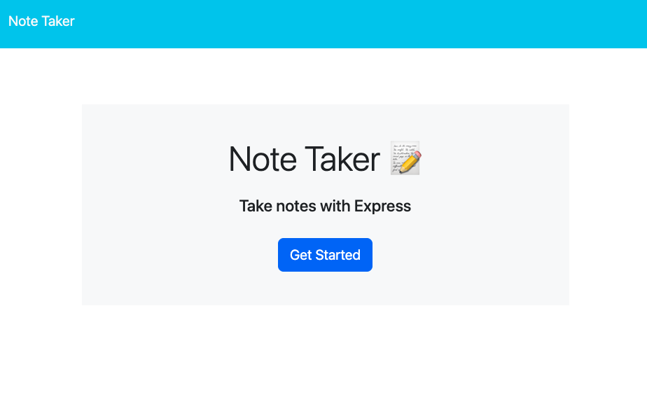
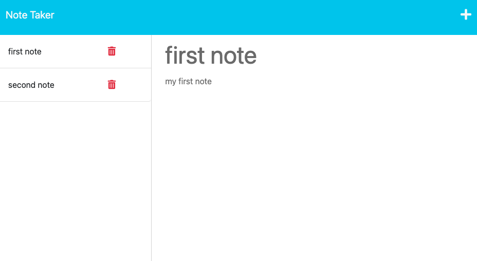

# Note Taker

This Note Taker application that can be used to write and save notes. The application will use an Express.js back end and will save and retrieve note data from a JSON file.

## Table of Contents

- [Snippets](#snippets)
- [Tech Stack](#tech-stack)
- [Requirements](#requirements)
    - [MVP](#mvp)
    - [Bonus](#bonus)
- [Features](#features)
- [Known Issues](#known-issues)
- [Future Goals](#future-goals)

## Snippets

Main

Notes  

## Tech Stack
- HTML
- CSS
- NodeJS
- Express

## Requirements

### MVP
On the back end, the application should include a `db.json` file that will be used to store and retrieve notes using the `fs` module.

The following HTML routes should be created:

- `GET /notes` should return the `notes.html` file.

- `GET *` should return the `index.html` file.

The following API routes should be created:

- `GET /api/notes` should read the `db.json` file and return all saved notes as JSON.

- `POST /api/notes` should receive a new note to save on the request body, add it to the `db.json` file, and then return the new note to the client. You'll need to find a way to give each note a unique id when it's saved (look into npm packages that could do this for you).
### Bonus  
- `DELETE /api/notes/:id` should receive a query parameter that contains the id of a note to delete. To delete a note, you'll need to read all notes from the `db.json` file, remove the note with the given `id` property, and then rewrite the notes to the `db.json` file.

## Features
- When open the Note Taker, there will be presented with a landing page with a link to a notes page

- When clicking on the link to the notes page
there will be presented with a page with existing notes listed in the left-hand column, plus empty fields to enter a new note title and the note’s text in the right-hand column

- When entering a new note title and the note’s text, a Save icon appears in the navigation at the top of the page. When clicking on the Save icon, the new note which has been entered is saved and appears in the left-hand column with the other existing notes
- When clicking on an existing note in the list in the left-hand column, that note appears in the right-hand column
- When clicking on the Write icon in the navigation at the top of the page there will be  presented with empty fields to enter a new note title and the note’s text in the right-hand column

## Known Issues  
 This application currently is using a .json file to mock the database

## Future Goals

- To use a real database to replace the JSON file
